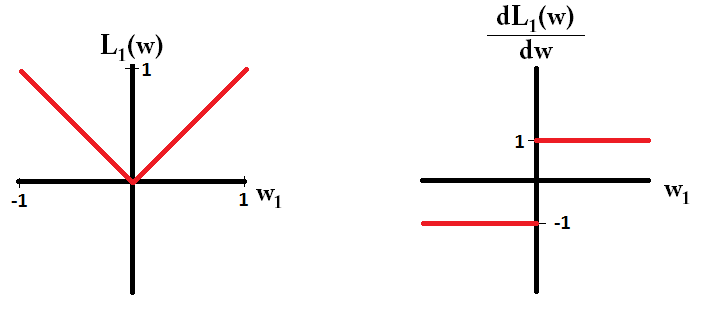
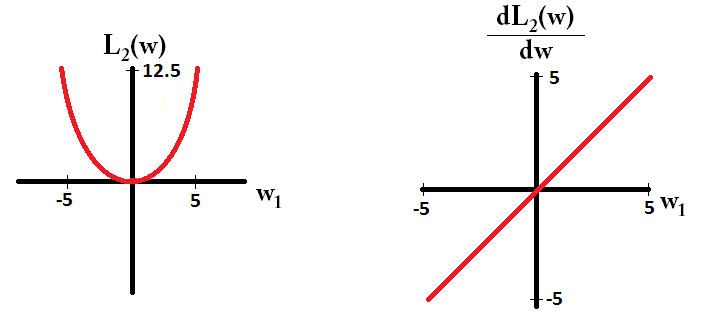
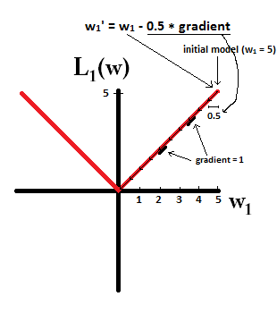
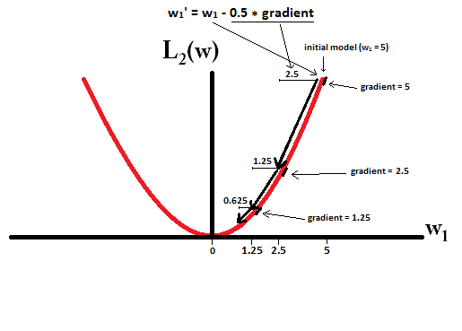

# Regularization Notes

# L1 and L2

https://stats.stackexchange.com/a/159379/202309

With a sparse model, we think of a model where many of the weights are 0. Let us therefore reason about how L1-regularization is more likely to create 0-weights.

Consider a model consisting of the weights $(w_1, w_2, \dots, w_m)$.

With L1 regularization, you penalize the model by a loss function $L_1(w)$ = $\Sigma_i |w_i|$.

With L2-regularization, you penalize the model by a loss function $L_2(w)$ = $\frac{1}{2} \Sigma_i w_i^2$

If using gradient descent, you will iteratively make the weights change in the opposite direction of the gradient with a step size $\eta$ multiplied with the gradient. This means that a more steep gradient will make us take a larger step, while a more flat gradient will make us take a smaller step. Let us look at the gradients (subgradient in case of L1):

$\frac{dL_1(w)}{dw} = sign(w)$, where $sign(w) = (\frac{w_1}{|w_1|}, \frac{w_2}{|w_2|}, \dots, \frac{w_m}{|w_m|})$

$\frac{dL_2(w)}{dw} = w$

If we plot the loss function and it's derivative for a model consisting of just a single parameter, it looks like this for L1:

And like this for L2:

[][2]

Notice that for $L_1$, the gradient is either 1 or -1, except for when $w_1 = 0$. That means that L1-regularization will move any weight towards 0 with the same step size, regardless the weight's value. In contrast, you can see that the $L_2$ gradient is linearly decreasing towards 0 as the weight goes towards 0. Therefore, L2-regularization will also move any weight towards 0, but it will take smaller and smaller steps as a weight approaches 0.

Try to imagine that you start with a model with $w_1 = 5$ and using $\eta = \frac{1}{2}$. In the following picture, you can see how gradient descent using L1-regularization makes 10 of the updates $w_1 := w_1 - \eta \cdot \frac{dL_1(w)}{dw} = w_1 - \frac{1}{2} \cdot 1$, until reaching a model with $w_1 = 0$:

In constrast, with L2-regularization where $\eta = \frac{1}{2}$, the gradient is $w_1$, causing every step to be only halfway towards 0. That is, we make the update $w_1 := w_1 - \eta \cdot \frac{dL_2(w)}{dw} = w_1 - \frac{1}{2} \cdot w_1$
Therefore, the model never reaches a weight of 0, regardless of how many steps we take:

Note that L2-regularization **can** make a weight reach zero if the step size $\eta$ is so high that it reaches zero in a single step. Even if L2-regularization on its own over or undershoots 0, it can still reach a weight of 0 when used together with an objective function that tries to minimize the error of the model with respect to the weights. In that case, finding the best weights of the model is a trade-off between regularizing (having small weights) and minimizing loss (fitting the training data), and the result of that trade-off can be that the best value for some weights are 0.

